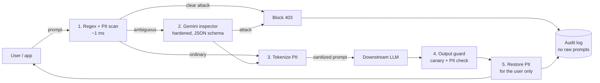

# PromptShield: AI guardrail & prompt-injection firewall

A security proxy between your users and an LLM. Every prompt is screened **before** it reaches the model, and every reply is screened **before** it reaches the user.

**Live app:** _add your deployed URL_ · **Demo login:** `demo@promptshield.dev` / `Demo@1234`

## The problem

Companies are putting LLMs in front of customer data. Three things go wrong: users paste personal data into prompts (it lands in third-party model logs), attackers use prompt injection and jailbreaks to make the model ignore its rules, and models leak system prompts or internal data in replies. Teams also have no audit trail showing what was blocked and why.

## How it works



| Differentiator | Where |
|---|---|
| **Inspector hardening**: random per-request boundary, "untrusted data" system instruction, schema-constrained JSON re-validated with Zod, fail-closed, a dedicated "attack on the firewall" rule | `backend/src/pipeline/inspector.js`, rule `inspector_tamper` |
| **Tiered pipeline with real latency**: Gemini is called only for ambiguous prompts; every stage reports its own milliseconds | `pipeline/index.js`; sandbox + dashboard |
| **Reversible redaction**: `[EMAIL_1]` tokens go to the model, real values are restored in the reply for the user only. The inspector also sees only tokens | `detectors.js` (`tokenize` / `detokenize`) |
| **Output guardrail with canary token**: a hidden marker in the system prompt; if it, or raw PII, shows up in a reply, the reply is withheld or redacted | `outputGuard.js` |
| **Transparency**: each decision stores the matched rules in plain language; "Why this decision?" drawer; CSV/JSON export | Audit log page, `/api/events` |
| **Measured red-team benchmark**: 47 prompts (29 attacks, 14 normal, 4 with PII); reports detection, false-positive and PII rates plus latency | Benchmark page, `backend/src/benchmark.js` |
| **Drop-in proxy**: OpenAI-compatible `POST /v1/chat/completions` authenticated with an API key | Integrate page |

**Privacy by design:** raw prompts and model replies are never written to the database. Only the PII-tokenized prompt is stored.

### Benchmark numbers (built-in suite, regex-only, no Gemini key)

Detection 79.3% (23/29), false positives 0% (0/14), PII redaction 100% (4/4), guardrail p95 under 1 ms. The misses are semantic roleplay attacks and weak-signal prompts: exactly what the Gemini tier is for. **Re-run the benchmark after adding your key and replace these numbers.** The suite is small and hand-written; use it as a regression check, not a certification.

## Tech stack

React 18 · Vite · React Router · Tailwind CSS 4 · Axios · Recharts · Node.js · Express · JWT · bcrypt · Zod · SQLite (better-sqlite3) · Google Gemini API (REST; key lives only in backend env vars)

## Run locally

```bash
cp backend/.env.example backend/.env     # set JWT_SECRET; GEMINI_API_KEY is optional
npm --prefix backend install && npm --prefix frontend install
npm run dev:backend      # terminal 1: API on :8080
npm run dev:frontend     # terminal 2: UI on :5173 (proxies /api and /v1 to :8080)
npm test                 # with the backend running: end-to-end smoke test
```

Without `GEMINI_API_KEY` the app runs regex-only and the downstream model is a clearly labelled simulation, so you can demo offline. With a key, the inspector and downstream model are real Gemini calls. Check `GEMINI_MODEL` against the models your key can use in Google AI Studio.

## Deploy (one service, simplest)

1. Push this repo to a public GitHub repository.
2. On [Render](https://render.com): **New → Blueprint**, select the repo (it reads `render.yaml`). Or **New → Web Service** with build command `npm run build` and start command `npm start`.
3. In the service's Environment tab add `GEMINI_API_KEY`. `JWT_SECRET` is generated for you.
4. Open the URL. The demo account and sample history are seeded on every boot.

Render's free tier sleeps when idle (open the URL once before judging) and its disk is ephemeral, so accounts registered by visitors reset on redeploy; the demo account is re-seeded. For persistence, attach a disk and set `DB_PATH` to it.

### Alternative: Vercel frontend + Render backend

Deploy `backend` as a Render web service (root directory `backend`, build `npm install`, start `npm start`) with `CORS_ORIGIN=https://your-app.vercel.app`. Deploy `frontend` on Vercel (Vite preset) with `VITE_API_URL=https://your-api.onrender.com`. `vercel.json` handles SPA routing.

## API

| Method | Path | Notes |
|---|---|---|
| POST | `/api/auth/register`, `/api/auth/login` | Zod-validated, bcrypt-hashed, returns a JWT |
| POST | `/api/chat` | `{prompt, guardrails}`; 403 when blocked |
| POST | `/v1/chat/completions` | OpenAI-compatible; Bearer JWT or `ps_` API key |
| GET | `/api/events`, `/api/events/:id`, `/api/events/export?format=csv\|json` | audit log |
| GET | `/api/stats` | dashboard data |
| GET / PUT | `/api/policy` | per-user policy |
| POST / GET | `/api/benchmark`, `/api/benchmark/latest` | red-team suite |

## Limitations

Pattern rules can be evaded by novel phrasing, and the Gemini tier reduces but does not eliminate that. PII detection is pattern-based (email, phone, SSN, Luhn-checked cards, Aadhaar, PAN, API keys) and misses names and addresses. The canary only catches verbatim leaks. This is defense in depth, not a guarantee.
